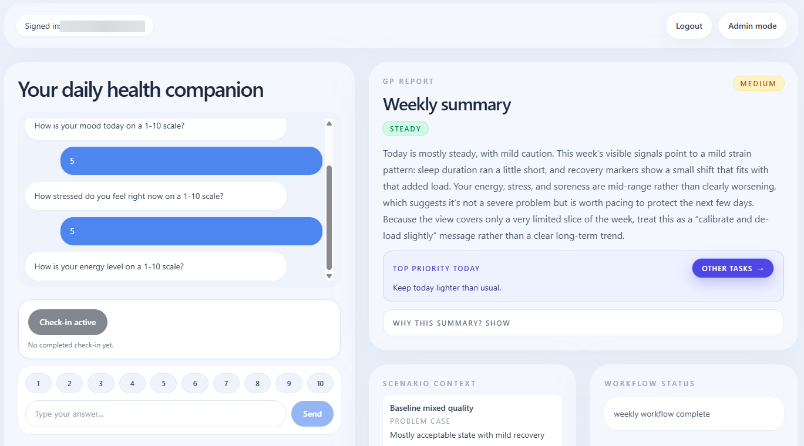
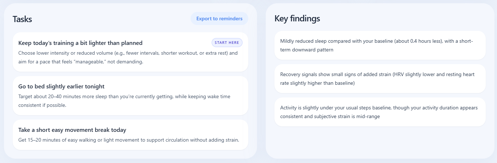
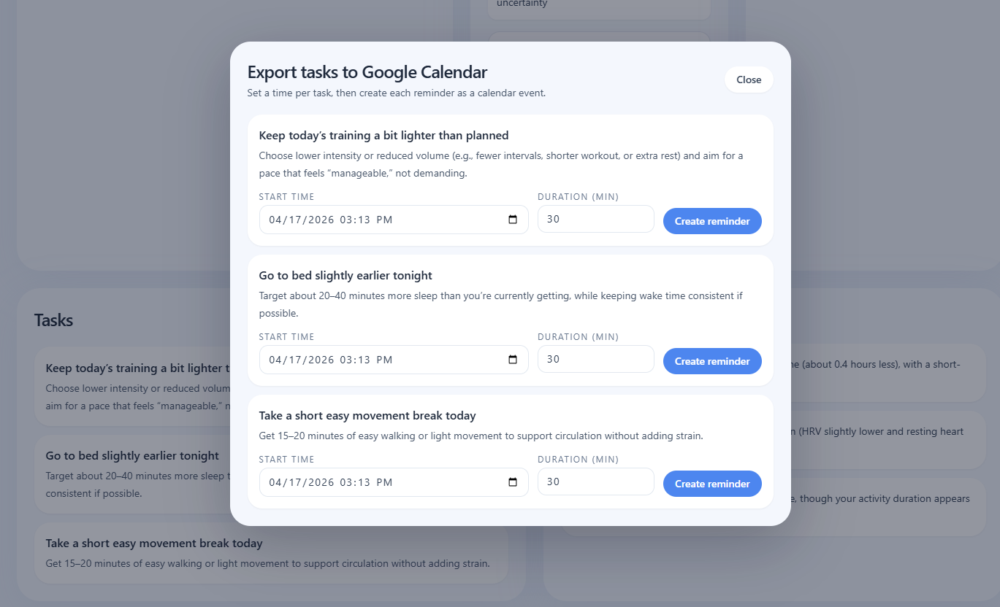
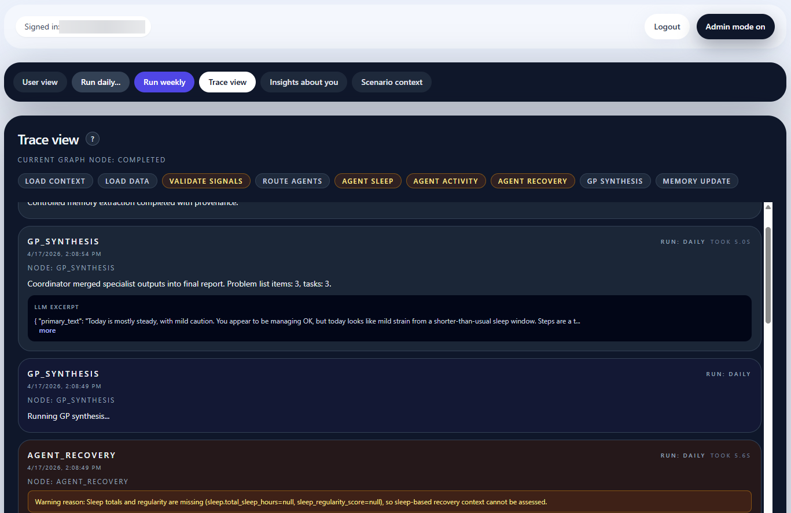

# AI Health Assistant

Web-based multi-agent health assistant MVP scaffold.

## Overview
This project explores a multi-agent architecture for a personal health assistant, where domain-specific agents (sleep, activity, recovery) analyze data independently and a coordinating GP layer synthesizes their outputs into a coherent, human-readable interpretation. The long-term vision is to evolve this into a continuously learning system that integrates wearable data, lab results, and user check-ins, supports longitudinal reasoning, and grounds recommendations with evidence (e.g., PubMed), moving toward a more structured and explainable form of AI-assisted health guidance.

The current implementation is a controlled MVP focused on system behavior and reproducibility. It uses simulated scenarios and a configurable timeline instead of real integrations, executes agents sequentially for clarity and traceability, and isolates the evidence layer (PubMed via MCP) from the core reasoning loop. The goal at this stage is not completeness, but to validate architecture, agent interaction patterns, and the quality of synthesized outputs in a predictable and testable environment.

## Screenshots

| Login | Admin dashboard |
| --- | --- |
|  |  |
| User view | Trace view |
|  |  |

## Requirements
- Python 3.11+
- Node.js 20+ (with Corepack enabled)
- Docker + Docker Compose (optional but recommended for full stack)

## Quick start (Docker Compose)
1. Copy `.env.example` to `.env`.
2. Set `OPENROUTER_API_KEY` in `.env`.
3. Run `docker compose up --build`.
4. Open `http://localhost:${APP_PORT:-8080}`.

To stop services:
- `docker compose down`

## Local backend
- `cd backend`
- `python -m poetry install`
- `python -m poetry run uvicorn health_assistant.main:app --reload`
- `python -m poetry run pytest`

## Local frontend
- `cd frontend`
- `corepack pnpm install`
- `corepack pnpm dev`
- `corepack pnpm build`

## Admin mode overview
1. **Log in**
   - The app is gated by authentication.
   - Use email-only registration/login (no password in MVP).
2. **Enter Admin mode**
   - Toggle **Admin mode** in the header.
3. **Use Admin tabs**
   - **User view**: end-user report and chat experience.
   - **Trace view**: workflow events, graph node, and elapsed timings.
   - **Insights about you**: short trend-derived memory insights.
   - **Dataset**: scenario selection and simulated date controls.

## Controlled PubMed evidence layer
Evidence retrieval is isolated and attached only to weekly runs.

- Daily runs do not fetch PubMed evidence.
- Weekly runs can attach 1-2 references for dominant issue keys.
- Core synthesis still succeeds if MCP is unavailable.

### Evidence configuration (`.env`)
- `HA_ENABLE_EVIDENCE=true|false`
- `HA_WEEKLY_EVIDENCE_MAX_ITEMS=2`
- `HA_MCP_TRANSPORT=http|stdio`
- `HA_PUBMED_MCP_URL=http://pubmed_mcp:8081`
- `HA_MCP_TIMEOUT_SECONDS=10`
- `HA_PUBMED_MCP_COMMAND=pubmed-mcp-server`
- `HA_PUBMED_MCP_ARGS=...`

## Deploy (generic)
For a Linux host with Docker:
1. Copy the repository to the target server.
2. Place a production `.env` in the project directory.
3. Run `docker compose up -d --build`.
4. Verify the app on the configured `APP_PORT`.

